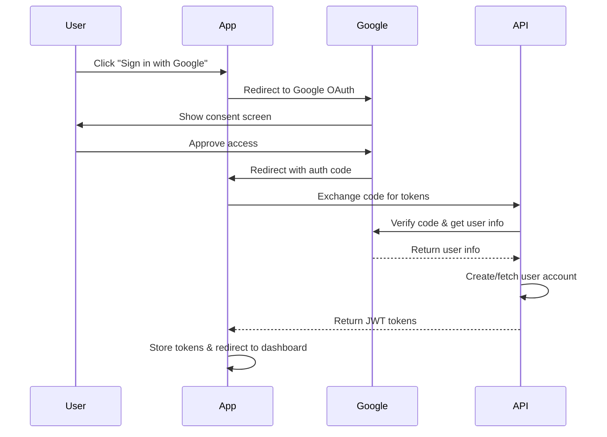

## Overview

Vega AI supports Google OAuth 2.0 for seamless authentication. Users can sign in with their Google accounts, eliminating the need to create and remember separate credentials.

<Note>
  Google OAuth must be enabled in the application configuration. In cloud mode, this is the primary authentication method.
</Note>

## OAuth Flow

The Google OAuth authentication follows the standard OAuth 2.0 authorization code flow:



## Web Routes

Google OAuth is implemented through web routes (not direct API endpoints):

### Initiate OAuth Flow

```http
GET /auth/google/login
```

Redirects the user to Google's OAuth consent screen. The endpoint:
- Generates a random state parameter for CSRF protection
- Stores the state in a secure, HTTP-only cookie
- Redirects to Google's authorization URL

### OAuth Callback

```http
GET /auth/google/callback?code={code}&state={state}
```

Handles the OAuth callback from Google. The endpoint:
- Validates the state parameter to prevent CSRF attacks
- Exchanges the authorization code for user information
- Creates or fetches the user account
- Generates JWT access and refresh tokens
- Sets authentication cookies
- Redirects to the application dashboard

## Implementation Details

The Google OAuth service (see `internal/auth/services/oauth.go`) performs the following:

### 1. Code Exchange

Exchanges the authorization code for an OAuth token:

```go
token, err := s.exchangeCode(ctx, code, redirect_uri)
```

### 2. User Info Retrieval

Fetches user information from Google's UserInfo API:

```go
type GoogleAuthUserInfo struct {
    ID            string `json:"id"`
    Email         string `json:"email"`
    VerifiedEmail bool   `json:"verified_email"`
}
```

### 3. User Creation/Lookup

- Looks up the user by email in the local database
- Creates a new user account if not found
- Uses the Google email as the username
- Sets the user role to `STANDARD`

### 4. Token Generation

Generates JWT access and refresh tokens (same format as standard login):

```go
accessToken, err := GenerateAccessToken(user, s.cfg)
refreshToken, err := GenerateRefreshToken(user, s.cfg)
```

## Configuration

Google OAuth requires the following environment variables:

<ParamField path="GOOGLE_CLIENT_ID" type="string" required>
  Google OAuth client ID from Google Cloud Console
</ParamField>

<ParamField path="GOOGLE_CLIENT_SECRET" type="string" required>
  Google OAuth client secret from Google Cloud Console
</ParamField>

<ParamField path="GOOGLE_CLIENT_REDIRECT_URL" type="string" required>
  Authorized redirect URI (e.g., `https://app.vega.ai/auth/google/callback`)
</ParamField>

<ParamField path="GOOGLE_AUTH_USER_INFO_SCOPE" type="string">
  OAuth scope for user info (default: `https://www.googleapis.com/auth/userinfo.email`)
</ParamField>

## Security Features

<AccordionGroup>
  <Accordion title="CSRF Protection">
    The OAuth flow includes state parameter validation:
    - A random 32-character state string is generated
    - Stored in a secure, HTTP-only cookie with 5-minute expiry
    - Validated on callback to ensure the request originated from the app
    - Cookie is cleared after validation
  </Accordion>

  <Accordion title="Email Verification">
    Google's UserInfo API returns an `verified_email` flag. Only users with verified Google email addresses can authenticate.
  </Accordion>

  <Accordion title="Secure Cookies">
    Authentication tokens are stored in HTTP-only cookies:
    - Cannot be accessed by JavaScript
    - Secured with SameSite and Secure flags
    - Automatically included in subsequent requests
  </Accordion>

  <Accordion title="Token Rotation">
    Refresh tokens are automatically rotated when used, ensuring that old tokens cannot be reused if compromised.
  </Accordion>
</AccordionGroup>

## Integration Example

For web applications, create a "Sign in with Google" button:

```html HTML
<a href="/auth/google/login" class="btn btn-google">
  
  Sign in with Google
</a>
```

```javascript JavaScript
// Handle Google OAuth login
function loginWithGoogle() {
  // Redirect to Google OAuth flow
  window.location.href = '/auth/google/login';
}

// After successful authentication, user is redirected to /jobs
// with authentication cookies set automatically
```

## Error Handling

The callback endpoint handles various error scenarios:

### Invalid State

```html
400 Bad Request

Redirects to login page with error:
"Invalid authentication request. Please try again."
```

### Missing Authorization Code

```html
400 Bad Request

Redirects to login page with error:
"Invalid authentication request. Please try again."
```

### Authentication Failure

```html
200 OK (renders login page with error)

"Authentication failed. Please try again later."
```

Possible causes:
- Failed to exchange authorization code
- Failed to retrieve user information from Google
- Database error when creating/fetching user
- Token generation failure

## Account Creation

When a user signs in with Google for the first time:

1. **User Lookup** - Checks if a user exists with the Google email
2. **Account Creation** - Creates a new user account if not found:
   - Username: Google email address
   - Password: Empty (no password-based login)
   - Role: `STANDARD`
   - Last Login: Current timestamp
3. **Token Generation** - Generates JWT tokens for the new user
4. **Redirect** - Redirects to the application dashboard

Subsequent logins will fetch the existing user account and update the last login timestamp.

## Retrieving Tokens

After successful Google OAuth authentication, JWT tokens are available:

### Via Cookies (Web)

Tokens are automatically set in HTTP-only cookies:
- `token` - Access token
- `refresh_token` - Refresh token

These cookies are automatically included in subsequent requests to the API.

### Via API (Mobile/Desktop)

For non-web clients, you'll need to:

1. Implement a web view to handle the OAuth flow
2. Intercept the callback URL
3. Extract tokens from the response
4. Store tokens securely in the native app

<Warning>
  For mobile/desktop apps, consider implementing a custom OAuth callback handler to extract tokens instead of relying on cookies.
</Warning>

## Next Steps

<CardGroup cols={2}>
  <Card title="Refresh Token" icon="arrows-rotate" href="/api/authentication/refresh-token">
    Learn how to refresh expired access tokens
  </Card>
  <Card title="Standard Login" icon="key" href="/api/authentication/login">
    Alternative authentication with username/password
  </Card>
</CardGroup>
