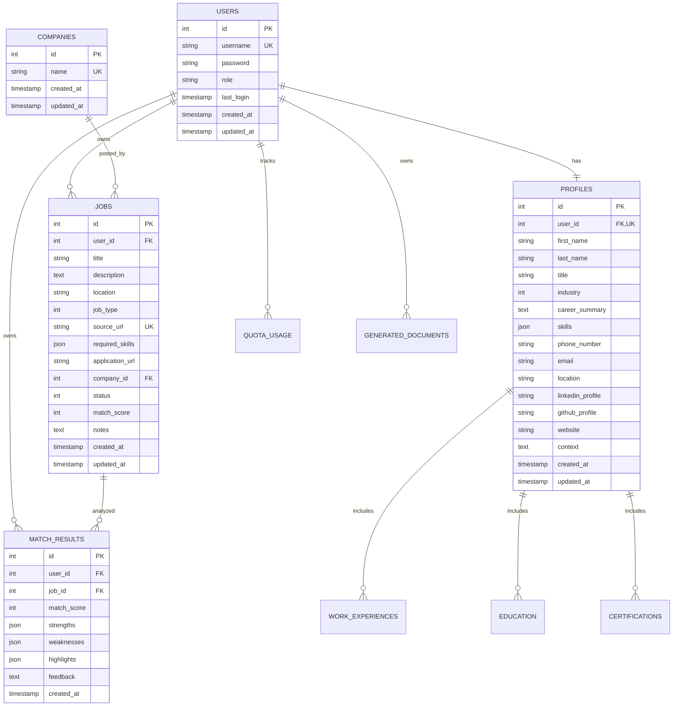

## Database Overview

Vega AI uses **SQLite** with Write-Ahead Logging (WAL) mode for concurrent reads and writes. The schema is designed with **multi-tenancy** in mind, ensuring complete data isolation between users.

## Schema Design Principles

<CardGroup cols={2}>
  <Card title="Multi-Tenant Isolation" icon="shield">
    All user data includes `user_id` foreign key with automatic filtering
  </Card>
  <Card title="Referential Integrity" icon="link">
    Foreign key constraints enforced at database level
  </Card>
  <Card title="Optimized Indexing" icon="bolt">
    Composite indexes on (user_id, field) for fast queries
  </Card>
  <Card title="Cascade Deletes" icon="trash">
    Automatic cleanup of related data when users are deleted
  </Card>
</CardGroup>

## Entity Relationship Diagram



## Core Tables

### Users Table

Authentication and user account management.

```sql
CREATE TABLE users (
    id INTEGER PRIMARY KEY AUTOINCREMENT,
    username TEXT NOT NULL,
    password TEXT,
    role TEXT NOT NULL DEFAULT 'user',
    last_login TIMESTAMP,
    created_at TIMESTAMP NOT NULL DEFAULT CURRENT_TIMESTAMP,
    updated_at TIMESTAMP NOT NULL DEFAULT CURRENT_TIMESTAMP
);

CREATE UNIQUE INDEX idx_users_username ON users(username);
```

**Key Fields:**

- `username` - Unique identifier for authentication
- `password` - Bcrypt-hashed password (nullable for OAuth-only users)
- `role` - User role (`user` or `admin`)
- `last_login` - Tracks last successful login

**Multi-Tenant Note:** Users table is the root of data isolation. All user-specific tables reference this via `user_id`.

### Companies Table

**Shared reference data** across all users.

```sql
CREATE TABLE companies (
    id INTEGER PRIMARY KEY AUTOINCREMENT,
    name TEXT NOT NULL,
    created_at TIMESTAMP NOT NULL DEFAULT CURRENT_TIMESTAMP,
    updated_at TIMESTAMP NOT NULL DEFAULT CURRENT_TIMESTAMP
);

CREATE UNIQUE INDEX idx_companies_name ON companies(name);
```

<Note>
  Companies table is **intentionally shared** across users to normalize company data and enable future features like company insights.
</Note>

### Jobs Table

Core entity for job postings with **user isolation**.

```sql
CREATE TABLE jobs (
    id INTEGER PRIMARY KEY AUTOINCREMENT,
    user_id INTEGER NOT NULL,
    title TEXT NOT NULL,
    description TEXT NOT NULL,
    location TEXT,
    job_type INTEGER NOT NULL DEFAULT 0,
    source_url TEXT,
    required_skills TEXT, -- JSON array
    application_url TEXT,
    company_id INTEGER NOT NULL,
    status INTEGER NOT NULL DEFAULT 0,
    match_score INTEGER,
    notes TEXT,
    created_at TIMESTAMP NOT NULL DEFAULT CURRENT_TIMESTAMP,
    updated_at TIMESTAMP NOT NULL DEFAULT CURRENT_TIMESTAMP,
    FOREIGN KEY (user_id) REFERENCES users(id) ON DELETE CASCADE,
    FOREIGN KEY (company_id) REFERENCES companies(id),
    CHECK (match_score IS NULL OR (match_score >= 0 AND match_score <= 100))
);

-- Multi-tenant indexes
CREATE INDEX idx_jobs_user_id ON jobs(user_id);
CREATE INDEX idx_jobs_user_id_status ON jobs(user_id, status);
CREATE INDEX idx_jobs_user_id_created_at ON jobs(user_id, created_at DESC);

-- Prevent duplicate job URLs per user
CREATE UNIQUE INDEX idx_jobs_user_id_source_url ON jobs(user_id, source_url);

-- Query optimization indexes
CREATE INDEX idx_jobs_title ON jobs(title);
CREATE INDEX idx_jobs_status ON jobs(status);
CREATE INDEX idx_jobs_match_score ON jobs(match_score);
CREATE INDEX idx_jobs_company_id ON jobs(company_id);
```

**Job Types (Enum):**

```go
const (
    JobTypeFullTime JobType = iota  // 0
    JobTypePartTime                  // 1
    JobTypeContract                  // 2
    JobTypeFreelance                 // 3
    JobTypeInternship                // 4
)
```

**Job Status (Enum):**

```go
const (
    StatusInterested Status = iota  // 0
    StatusApplied                   // 1
    StatusInterviewing              // 2
    StatusOffered                   // 3
    StatusRejected                  // 4
    StatusWithdrawn                 // 5
)
```

**Example Query with User Isolation:**

```go
// All queries automatically filtered by user_id
sql, args, _ := sq.Select("*").
    From("jobs").
    Where(sq.Eq{"user_id": userID, "status": StatusApplied}).
    OrderBy("created_at DESC").
    ToSql()
```

### Profiles Table

User professional profile with **1:1 relationship** to users.

```sql
CREATE TABLE profiles (
    id INTEGER PRIMARY KEY AUTOINCREMENT,
    user_id INTEGER NOT NULL UNIQUE,
    first_name TEXT DEFAULT '',
    last_name TEXT DEFAULT '',
    title TEXT DEFAULT '',
    industry INTEGER DEFAULT 64, -- IndustryUnspecified
    career_summary TEXT DEFAULT '',
    skills TEXT DEFAULT '', -- JSON string
    phone_number TEXT DEFAULT '',
    email TEXT DEFAULT '',
    location TEXT DEFAULT '',
    linkedin_profile TEXT DEFAULT '',
    github_profile TEXT DEFAULT '',
    website TEXT DEFAULT '',
    context TEXT DEFAULT '',
    created_at TIMESTAMP DEFAULT CURRENT_TIMESTAMP,
    updated_at TIMESTAMP DEFAULT CURRENT_TIMESTAMP,
    FOREIGN KEY (user_id) REFERENCES users(id) ON DELETE CASCADE
);

CREATE INDEX idx_profiles_user_id ON profiles(user_id);

-- Automatic profile creation trigger
CREATE TRIGGER create_profile_after_user_insert
AFTER INSERT ON users
FOR EACH ROW
BEGIN
  INSERT INTO profiles (user_id, created_at) VALUES (NEW.id, CURRENT_TIMESTAMP);
END;
```

**Industry Enum:**

```go
const (
    IndustryTechnology Industry = iota        // 0
    IndustryHealthcare                         // 1
    IndustryFinance                            // 2
    IndustryEducation                          // 3
    IndustryRetail                             // 4
    IndustryManufacturing                      // 5
    // ... (64 total industries)
    IndustryUnspecified Industry = 64          // Default
)
```

### Work Experiences Table

Professional work history with **1:many relationship** to profiles.

```sql
CREATE TABLE work_experiences (
    id INTEGER PRIMARY KEY AUTOINCREMENT,
    profile_id INTEGER NOT NULL,
    company TEXT NOT NULL,
    title TEXT NOT NULL,
    location TEXT,
    start_date TIMESTAMP NOT NULL,
    end_date TIMESTAMP,
    description TEXT,
    current BOOLEAN DEFAULT 0,
    created_at TIMESTAMP DEFAULT CURRENT_TIMESTAMP,
    updated_at TIMESTAMP DEFAULT CURRENT_TIMESTAMP,
    FOREIGN KEY (profile_id) REFERENCES profiles(id) ON DELETE CASCADE
);

CREATE INDEX idx_work_experiences_profile_id ON work_experiences(profile_id);
CREATE INDEX idx_work_experiences_start_date ON work_experiences(start_date);
```

### Education Table

Educational background with **1:many relationship** to profiles.

```sql
CREATE TABLE education (
    id INTEGER PRIMARY KEY AUTOINCREMENT,
    profile_id INTEGER NOT NULL,
    institution TEXT NOT NULL,
    degree TEXT NOT NULL,
    field_of_study TEXT,
    start_date TIMESTAMP NOT NULL,
    end_date TIMESTAMP,
    description TEXT,
    created_at TIMESTAMP DEFAULT CURRENT_TIMESTAMP,
    updated_at TIMESTAMP DEFAULT CURRENT_TIMESTAMP,
    FOREIGN KEY (profile_id) REFERENCES profiles(id) ON DELETE CASCADE
);

CREATE INDEX idx_education_profile_id ON education(profile_id);
CREATE INDEX idx_education_start_date ON education(start_date);
```

### Certifications Table

Professional certifications with **1:many relationship** to profiles.

```sql
CREATE TABLE certifications (
    id INTEGER PRIMARY KEY AUTOINCREMENT,
    profile_id INTEGER NOT NULL,
    name TEXT NOT NULL,
    issuing_org TEXT NOT NULL,
    issue_date TIMESTAMP NOT NULL,
    expiry_date TIMESTAMP,
    credential_id TEXT,
    credential_url TEXT,
    created_at TIMESTAMP DEFAULT CURRENT_TIMESTAMP,
    updated_at TIMESTAMP DEFAULT CURRENT_TIMESTAMP,
    FOREIGN KEY (profile_id) REFERENCES profiles(id) ON DELETE CASCADE
);

CREATE INDEX idx_certifications_profile_id ON certifications(profile_id);
CREATE INDEX idx_certifications_issue_date ON certifications(issue_date);
```

### Match Results Table

AI-generated job compatibility analysis with **user isolation**.

```sql
CREATE TABLE match_results (
    id INTEGER PRIMARY KEY AUTOINCREMENT,
    user_id INTEGER NOT NULL,
    job_id INTEGER NOT NULL,
    match_score INTEGER NOT NULL,
    strengths TEXT,  -- JSON array
    weaknesses TEXT, -- JSON array
    highlights TEXT, -- JSON array
    feedback TEXT,
    created_at TIMESTAMP NOT NULL DEFAULT CURRENT_TIMESTAMP,
    FOREIGN KEY (user_id) REFERENCES users(id) ON DELETE CASCADE,
    FOREIGN KEY (job_id) REFERENCES jobs(id) ON DELETE CASCADE,
    CHECK (match_score >= 0 AND match_score <= 100)
);

CREATE INDEX idx_match_results_user_id ON match_results(user_id);
CREATE INDEX idx_match_results_job_id ON match_results(job_id);
CREATE INDEX idx_match_results_user_id_created_at ON match_results(user_id, created_at DESC);
```

**Example Match Result:**

```json
{
  "match_score": 85,
  "strengths": [
    "5+ years Go experience",
    "Strong system design skills",
    "Cloud architecture expertise"
  ],
  "weaknesses": [
    "Limited Kubernetes experience",
    "No AWS certifications"
  ],
  "highlights": [
    "Led migration to microservices",
    "Built distributed systems"
  ],
  "feedback": "Strong technical match with opportunities for cloud platform growth."
}
```

## Quota System Tables

### Quota Usage Table

Tracks AI analysis usage per user (cloud mode only).

```sql
CREATE TABLE quota_usage (
    id INTEGER PRIMARY KEY AUTOINCREMENT,
    user_id INTEGER NOT NULL,
    quota_type TEXT NOT NULL,
    period_start TIMESTAMP NOT NULL,
    period_end TIMESTAMP NOT NULL,
    used_count INTEGER NOT NULL DEFAULT 0,
    limit_count INTEGER NOT NULL,
    created_at TIMESTAMP NOT NULL DEFAULT CURRENT_TIMESTAMP,
    updated_at TIMESTAMP NOT NULL DEFAULT CURRENT_TIMESTAMP,
    FOREIGN KEY (user_id) REFERENCES users(id) ON DELETE CASCADE
);

CREATE INDEX idx_quota_usage_user_id ON quota_usage(user_id);
CREATE INDEX idx_quota_usage_user_id_type_period ON quota_usage(user_id, quota_type, period_start, period_end);
```

**Quota Types:**

- `ai_analysis` - Monthly limit: 10 new job analyses
- `job_search` - Unlimited (tracked but not enforced)

### Quota Usage History Table

```sql
CREATE TABLE quota_usage_history (
    id INTEGER PRIMARY KEY AUTOINCREMENT,
    user_id INTEGER NOT NULL,
    quota_type TEXT NOT NULL,
    job_id INTEGER,
    action TEXT NOT NULL,
    created_at TIMESTAMP NOT NULL DEFAULT CURRENT_TIMESTAMP,
    FOREIGN KEY (user_id) REFERENCES users(id) ON DELETE CASCADE,
    FOREIGN KEY (job_id) REFERENCES jobs(id) ON DELETE SET NULL
);

CREATE INDEX idx_quota_history_user_id ON quota_usage_history(user_id);
CREATE INDEX idx_quota_history_created_at ON quota_usage_history(created_at DESC);
```

## Document Generation Tables

### Generated Documents Table

Stores AI-generated CVs and cover letters.

```sql
CREATE TABLE generated_documents (
    id INTEGER PRIMARY KEY AUTOINCREMENT,
    user_id INTEGER NOT NULL,
    job_id INTEGER,
    document_type TEXT NOT NULL,
    content TEXT NOT NULL,
    format TEXT NOT NULL DEFAULT 'html',
    metadata TEXT, -- JSON
    expires_at TIMESTAMP,
    created_at TIMESTAMP NOT NULL DEFAULT CURRENT_TIMESTAMP,
    FOREIGN KEY (user_id) REFERENCES users(id) ON DELETE CASCADE,
    FOREIGN KEY (job_id) REFERENCES jobs(id) ON DELETE SET NULL
);

CREATE INDEX idx_generated_documents_user_id ON generated_documents(user_id);
CREATE INDEX idx_generated_documents_job_id ON generated_documents(job_id);
CREATE INDEX idx_generated_documents_expires_at ON generated_documents(expires_at);
```

**Document Types:**

- `cv` - Full curriculum vitae
- `cover_letter` - Job-specific cover letter

**Retention Policy:**

- Documents expire after 30 days
- Automatic cleanup via cron job or manual trigger

## Multi-Tenant Data Isolation

### Row-Level Security Pattern

All queries automatically filtered by `user_id`:

```go
// Repository pattern enforces user isolation
func (r *JobRepository) GetByID(ctx context.Context, userID int, id int) (*models.Job, error) {
    sql, args, _ := sq.Select("*").
        From("jobs").
        Where(sq.Eq{"user_id": userID, "id": id}). // Always filtered
        ToSql()

    var job models.Job
    err := r.db.QueryRowContext(ctx, sql, args...).Scan(&job)
    return &job, err
}
```

### Cache Isolation Pattern

Cache keys prefixed with user ID:

```go
func (s *JobService) GetByID(ctx context.Context, userID int, id int) (*models.Job, error) {
    cacheKey := fmt.Sprintf("job:u%d:%d", userID, id) // User-scoped key

    var job models.Job
    if err := s.cache.Get(ctx, cacheKey, &job); err == nil {
        return &job, nil
    }

    job, err := s.repo.GetByID(ctx, userID, id)
    if err == nil {
        s.cache.Set(ctx, cacheKey, job, time.Hour)
    }
    return job, err
}
```

## Database Configuration

### SQLite WAL Mode

```go
dbConnectionString := "/app/data/vega.db?_journal_mode=WAL"
db, err := sql.Open("sqlite", dbConnectionString)

db.SetMaxOpenConns(25)    // Concurrent connections
db.SetMaxIdleConns(5)     // Idle pool size
db.SetConnMaxLifetime(5 * time.Minute)
db.SetConnMaxIdleTime(1 * time.Minute)
```

**WAL Benefits:**

- Concurrent reads and writes
- Better performance for multi-user scenarios
- Reduced lock contention

### Migration Strategy

```bash
migrations/sqlite/
├── 000001_initial_schema.up.sql       # Core tables
├── 000003_add_quota_system.up.sql     # Quota tables
├── 000005_add_search_quotas.up.sql    # Search tracking
├── 000006_add_quota_configs.up.sql    # Quota configuration
├── 000008_add_document_retention.up.sql # Document expiry
├── 000009_add_job_deduplication.up.sql # Unique constraints
└── 000010_add_job_filtering_index.up.sql # Performance indexes
```

<Note>
  Migrations are applied automatically on application startup using `golang-migrate/migrate`.
</Note>

## Performance Optimization

### Composite Indexes

```sql
-- Multi-tenant query optimization
CREATE INDEX idx_jobs_user_id_status ON jobs(user_id, status);
CREATE INDEX idx_jobs_user_id_created_at ON jobs(user_id, created_at DESC);

-- Sorting and filtering
CREATE INDEX idx_jobs_user_id_match_score ON jobs(user_id, match_score DESC);
```

### Query Patterns

```go
// Efficient pagination
sql, args, _ := sq.Select("*").
    From("jobs").
    Where(sq.Eq{"user_id": userID}).
    OrderBy("created_at DESC").
    Limit(20).
    Offset((page - 1) * 20).
    ToSql()

// Count query optimization
sql, args, _ := sq.Select("COUNT(*)").
    From("jobs").
    Where(sq.Eq{"user_id": userID, "status": StatusApplied}).
    ToSql()
```

<Note>
  This schema design ensures **complete data isolation**, **referential integrity**, and **optimal query performance** for multi-tenant deployments.
</Note>
