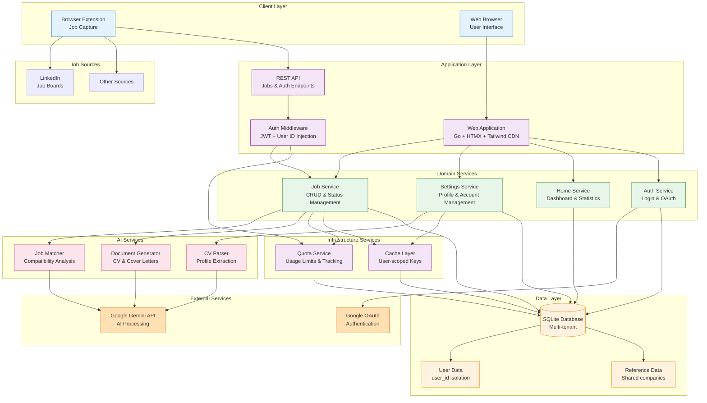

## System Overview

Vega AI is a Go web application for AI-powered job search and application tracking, built with privacy and multi-tenancy in mind. The system follows a clean, domain-driven layered architecture with clear separation of concerns.

### Architecture Diagram



## Architecture Patterns

### Layered Architecture

Vega AI follows a **domain-driven layered architecture** with clear boundaries:

<CardGroup cols={2}>
  <Card title="Handlers" icon="layer-group">
    HTTP request/response handling, template rendering, and input validation
  </Card>
  <Card title="Services" icon="gears">
    Business logic, AI integration, and domain operations
  </Card>
  <Card title="Repositories" icon="database">
    Data access layer with interface-based design for testability
  </Card>
  <Card title="Database" icon="server">
    SQLite with transaction support and multi-tenant isolation
  </Card>
</CardGroup>

### Request Flow

```go
// Example: Creating a job
Handler → Service → Repository → Database
  ↓         ↓           ↓
Validate  Business   Data Access
Input     Logic      + Caching
```

**Key Principles:**
- **Handlers** → HTTP layer, no business logic
- **Services** → Core business rules, orchestration
- **Repositories** → Database operations only
- **Database** → Data persistence with constraints

## Application Entry Points

The application follows a clean initialization flow:

### Main Entry Point

<Note>
  **Location:** `cmd/vega/main.go`
</Note>

```go
func main() {
    cfg := config.NewSettings()
    app := vega.New(cfg)

    if err := app.Run(); err != nil {
        log.Fatalf("Failed to start: %v", err)
    }

    app.WaitForShutdown()
}
```

### Application Core

The `App` struct serves as the central application container:

```go
type App struct {
    config      config.Settings
    router      *gin.Engine
    db          *sql.DB
    cache       cache.Cache
    server      *http.Server
    done        chan os.Signal
    renderer    *render.HTMLRenderer
    authLimiter *localmiddleware.RateLimiter
}
```

### Initialization Flow

<Steps>
  <Step title="New()">
    Creates app instance with router, CORS, and template loading
  </Step>
  <Step title="Setup()">
    Initializes logging, database, cache, migrations, and admin user
  </Step>
  <Step title="SetupRoutes()">
    Configures all routes, middleware, and service dependencies
  </Step>
  <Step title="Run()">
    Starts HTTP server with graceful shutdown support
  </Step>
  <Step title="WaitForShutdown()">
    Blocks until SIGINT/SIGTERM, then cleans up resources
  </Step>
</Steps>

## Service Initialization

Services are initialized in dependency order in `internal/vega/routes.go:26`:

```go
func SetupRoutes(a *App) {
    // 1. AI Service (graceful degradation if unavailable)
    aiService, err := ai.Setup(&a.config)
    if err != nil {
        log.Warn().Err(err).Msg("AI features disabled")
        aiService = nil
    }

    // 2. Authentication
    authHandler, authService := auth.SetupAuthWithService(a.db, &a.config)

    // 3. Job Service with cache
    jobService := job.SetupService(a.db, &a.config, a.cache)

    // 4. Quota Service
    jobRepo := job.SetupJobRepository(a.db, a.cache)
    quotaAdapter := quota.NewJobRepositoryAdapter(jobRepo)
    unifiedQuotaService := quota.NewUnifiedService(a.db, quotaAdapter, a.config.IsCloudMode)

    // 5. Settings and other handlers
    settingsHandler, _ := settings.SetupWithService(&a.config, a.db, aiService, unifiedQuotaService, authService)
    // ...
}
```

## Key Design Patterns

### 1. Dependency Injection

Services receive dependencies through constructors:

```go
func NewJobHandler(service *JobService, config *config.Settings) (*JobHandler, error) {
    return &JobHandler{
        service: service,
        config:  config,
    }, nil
}
```

### 2. Interface-Based Design

Repositories use interfaces for testability:

```go
type JobRepository interface {
    Create(ctx context.Context, userID int, job *models.Job) error
    GetByID(ctx context.Context, userID int, id int) (*models.Job, error)
    // ...
}
```

### 3. Graceful Degradation

AI service failure doesn't crash the app:

```go
aiService, err := ai.Setup(&a.config)
if err != nil {
    log.Warn().Err(err).Msg("AI service initialization failed")
    aiService = nil // App continues without AI features
}
```

### 4. Mode-Based Configuration

Cloud vs self-hosted behavior differences:

```go
if a.config.IsCloudMode {
    // Google OAuth required
    a.router.GET("/auth/login", authHandler.GetLoginPage)
} else {
    // Username/password authentication
    authLimiter := localmiddleware.NewAuthRateLimiter()
    auth.RegisterPublicRoutes(authGroup, authHandler, authLimiter)
}
```

### 5. Middleware Composition

```go
a.router.Use(localmiddleware.RequestID())
a.router.Use(globalErrorHandler(a.renderer))
a.router.Use(localmiddleware.RequestTimeout(30 * time.Second))

if a.config.EnableSecurityHeaders {
    a.router.Use(middleware.SecurityHeaders())
}

if a.config.EnableCSRF {
    a.router.Use(middleware.CSRF(&a.config))
}
```

### 6. Clean Shutdown

Proper resource cleanup on termination:

```go
func (a *App) Shutdown(ctx context.Context) error {
    var err error

    if a.server != nil {
        err = a.server.Shutdown(ctx)
    }

    if a.db != nil {
        dbErr := a.db.Close()
        if err == nil { err = dbErr }
    }

    if a.cache != nil {
        cacheErr := a.cache.Close()
        if err == nil { err = cacheErr }
    }

    if a.authLimiter != nil {
        a.authLimiter.Stop()
    }

    return err
}
```

## AI Integration Architecture

Vega AI uses a pluggable AI architecture with Google Gemini:

<CardGroup cols={2}>
  <Card title="Job Matcher" icon="stars">
    Analyzes job-profile compatibility using AI
  </Card>
  <Card title="Letter Generator" icon="envelope">
    Creates personalized cover letters
  </Card>
  <Card title="CV Generator" icon="file-lines">
    Generates professional CVs from profiles
  </Card>
  <Card title="CV Parser" icon="file-import">
    Extracts profile data from uploaded CVs
  </Card>
</CardGroup>

### AI Service Structure

```go
type AIService struct {
    JobMatcher           *services.JobMatcherService
    CoverLetterGenerator *services.CoverLetterGeneratorService
    CVParser             *services.CVParserService
    CVGenerator          *services.CVGeneratorService
}
```

### AI Processing Flow

<Steps>
  <Step title="Data Retrieval">
    User profile and job data retrieved from database
  </Step>
  <Step title="Prompt Generation">
    Structured prompts generated using templates
  </Step>
  <Step title="AI Processing">
    Gemini API processes the request with model selection
  </Step>
  <Step title="Validation">
    Results validated and sanitized
  </Step>
  <Step title="Storage">
    Match results stored in database for history
  </Step>
</Steps>

## Quota System

The quota system manages usage limits for AI-powered features in cloud mode:

<CardGroup cols={3}>
  <Card title="AI Analysis" icon="chart-line">
    10 analyses/month for new jobs
  </Card>
  <Card title="Job Search" icon="magnifying-glass">
    Unlimited tracking for all users
  </Card>
  <Card title="Re-analysis" icon="rotate">
    Unlimited for existing jobs
  </Card>
</CardGroup>

```go
// Quota check before AI analysis
result, err := quotaService.CanAnalyzeJob(ctx, userID, jobID)
if !result.Allowed {
    // Handle quota exceeded
}

// Record usage after successful analysis
err = quotaService.RecordJobAnalysis(ctx, userID, jobID)
```

## Code Organization Best Practices

<Steps>
  <Step title="Domain Separation">
    Each package owns its domain with clear boundaries
  </Step>
  <Step title="Interface Boundaries">
    Repository interfaces defined in domain packages
  </Step>
  <Step title="Dependency Injection">
    Services receive dependencies through constructors
  </Step>
  <Step title="Error Handling">
    Wrapped errors with context for debugging
  </Step>
  <Step title="Privacy First">
    No PII in logs or errors (GDPR-compliant)
  </Step>
</Steps>

<Note>
  This architecture provides clear separation of concerns, testability through dependency injection, and flexibility for different deployment modes (cloud vs self-hosted).
</Note>
