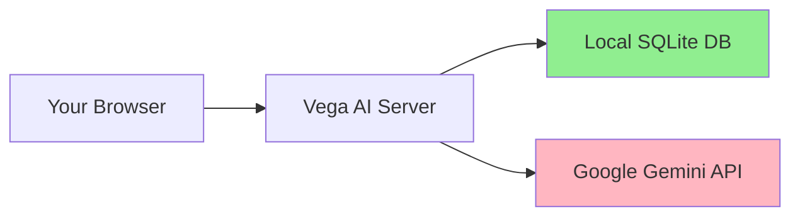

## AI-Powered Features

Vega AI leverages Google Gemini AI to provide intelligent insights and automated document generation throughout your job search journey.

<CardGroup cols={2}>
  <Card
    title="Smart Job Matching"
    icon="brain-circuit"
  >
    Get AI-powered compatibility scores (0-100) for each job based on your profile, with detailed analysis of strengths, weaknesses, and actionable feedback.
  </Card>
  <Card
    title="Cover Letter Generation"
    icon="file-lines"
  >
    Generate personalized, professional cover letters tailored to each job posting and your unique background in seconds.
  </Card>
  <Card
    title="CV Generation"
    icon="file-user"
  >
    Create job-specific CVs that highlight relevant experience and skills, optimized for each application.
  </Card>
  <Card
    title="CV Parsing"
    icon="file-import"
  >
    Upload your existing CV and let AI automatically extract and populate your profile with work experience, education, and skills.
  </Card>
</CardGroup>

### Job Match Analysis

The AI match analysis provides comprehensive insights:

```go
// Example match analysis structure from internal/job/services_ai.go
type JobMatchAnalysis struct {
    JobID      int       // Job being analyzed
    UserID     int       // User profile reference
    MatchScore int       // 0-100 compatibility score
    Strengths  []string  // Your competitive advantages
    Weaknesses []string  // Areas needing improvement
    Highlights []string  // Key selling points to emphasize
    Feedback   string    // Detailed actionable advice
    AnalyzedAt time.Time // Analysis timestamp
}
```

<Note>
  **Experience-Aware Analysis:** For candidates with 2+ years of experience, the AI automatically emphasizes work history over education, ensuring relevant evaluation criteria.
</Note>

### Document Generation

Generate professional documents optimized for each application:

- **Cover Letters:** Personalized letters that connect your experience to job requirements
- **Tailored CVs:** Job-specific resumes highlighting relevant skills and achievements
- **Profile Integration:** Documents include your contact information, work history, education, and certifications
- **Context-Aware:** AI considers your career summary and additional context for accurate representation

## Job Management

<CardGroup cols={2}>
  <Card
    title="Application Tracking"
    icon="list-check"
  >
    Track all job applications with customizable statuses: Applied, Screening, Interview, Offer, Rejected, Withdrawn.
  </Card>
  <Card
    title="Job Details"
    icon="circle-info"
  >
    Store comprehensive job information including title, company, description, location, salary range, and required skills.
  </Card>
  <Card
    title="Company Database"
    icon="building"
  >
    Shared reference database for company information to maintain consistency across job postings.
  </Card>
  <Card
    title="Match History"
    icon="clock-rotate-left"
  >
    View historical match analysis results to track how your profile alignment changes over time.
  </Card>
</CardGroup>

### Job Capture Workflow

<Steps>
  <Step title="Discover Opportunities">
    Browse jobs on LinkedIn or any job board.
  </Step>
  <Step title="One-Click Capture">
    Use the browser extension to capture job details with a single click.
  </Step>
  <Step title="Automatic Organization">
    Jobs are automatically added to your tracking system with all relevant details.
  </Step>
  <Step title="AI Analysis">
    Optionally analyze job compatibility immediately after capture.
  </Step>
</Steps>

## Profile Management

<CardGroup cols={2}>
  <Card
    title="Comprehensive Profile"
    icon="id-card"
  >
    Maintain detailed professional information including personal details, career summary, industry, and context.
  </Card>
  <Card
    title="Work Experience"
    icon="briefcase"
  >
    Track your employment history with company, title, dates, location, and detailed descriptions.
  </Card>
  <Card
    title="Education"
    icon="graduation-cap"
  >
    Record degrees, institutions, fields of study, and dates for all your educational background.
  </Card>
  <Card
    title="Skills"
    icon="wrench"
  >
    List technical and soft skills that the AI uses for job matching and document generation.
  </Card>
  <Card
    title="Certifications"
    icon="certificate"
  >
    Include professional certifications with issuing organization, dates, and credential IDs.
  </Card>
  <Card
    title="Experience Calculation"
    icon="calculator"
  >
    Automatic calculation of total years of experience with overlap handling for concurrent roles.
  </Card>
</CardGroup>

### Profile Validation

For AI operations, Vega AI ensures your profile contains sufficient information:

```go
// Validation requirements from internal/job/services_ai.go:510
// Required for AI features:
// - First name OR last name
// - Career summary OR work experience OR education
// - For work experience: detailed title and company information
```

<Warning>
  AI features require a complete profile with at least your name and career information (summary, experience, or education).
</Warning>

## Browser Extension

The **Vega AI Job Capture** browser extension streamlines job discovery and tracking.

### Extension Features

- **LinkedIn Integration:** Capture jobs directly from LinkedIn job postings
- **One-Click Capture:** Extract job title, company, description, and requirements automatically
- **API Authentication:** Secure connection to your Vega AI instance using JWT tokens
- **Multi-Platform:** Works with both cloud and self-hosted deployments

### Installation

<Steps>
  <Step title="Download Extension">
    Get the latest release from [GitHub Releases](https://github.com/benidevo/vega-ai-extension/releases/latest).
  </Step>
  <Step title="Extract Files">
    Unzip the downloaded file to a folder on your computer.
  </Step>
  <Step title="Load in Chrome">
    Navigate to `chrome://extensions/`, enable Developer mode, and click "Load unpacked".
  </Step>
  <Step title="Configure">
    Connect the extension to your Vega AI instance with your API credentials.
  </Step>
</Steps>

## Security & Privacy

<CardGroup cols={2}>
  <Card
    title="Multi-Tenant Isolation"
    icon="user-lock"
  >
    Row-level security ensures complete data isolation between users with automatic user_id filtering in all queries.
  </Card>
  <Card
    title="Authentication"
    icon="key"
  >
    JWT-based sessions with configurable expiration. Supports username/password and Google OAuth authentication.
  </Card>
  <Card
    title="GDPR-Compliant Logging"
    icon="shield-check"
  >
    Privacy-aware logging that never records PII. Uses anonymous user references and hashed identifiers.
  </Card>
  <Card
    title="Secure Deployment"
    icon="lock"
  >
    CSRF protection, security headers, and Docker secrets support for production environments.
  </Card>
</CardGroup>

### Authentication Methods

1. **Username/Password:** Default authentication for self-hosted deployments
   - Default credentials: `admin` / `VegaAdmin` (change immediately after first login)
   - JWT tokens with configurable expiration (60 min access, 168 hours refresh)

2. **Google OAuth:** Available in cloud mode
   - No passwords stored in database
   - Secure third-party authentication
   - Automatic profile creation

### Data Privacy



- **Self-Hosted:** All job and profile data stays on your infrastructure
- **AI Processing:** Only job descriptions and profile summaries sent to Gemini API
- **No Third-Party Storage:** Your data is never stored by external services

## Quota System

For cloud deployments, Vega AI includes a fair usage quota system.

### Quota Types

<CardGroup cols={2}>
  <Card
    title="AI Analysis Quota"
    icon="chart-line"
  >
    **10 analyses per month** in cloud mode. Unlimited re-analysis of previously analyzed jobs.
  </Card>
  <Card
    title="Job Tracking"
    icon="infinity"
  >
    **Unlimited** job tracking and management for all users.
  </Card>
  <Card
    title="Self-Hosted Mode"
    icon="server"
  >
    **No quotas** - unlimited AI features when you provide your own Gemini API key.
  </Card>
  <Card
    title="Quota Reporting"
    icon="gauge"
  >
    Real-time quota status available via API endpoint `/api/jobs/quota`.
  </Card>
</CardGroup>

### Quota Implementation

From `internal/quota/unified_service.go`, the quota system:

- Tracks first-time job analyses against monthly limits
- Allows unlimited re-analysis of existing jobs
- Gracefully handles quota exceeded scenarios
- Provides detailed quota status (used, limit, remaining, reset date)

<Note>
  Quota resets occur monthly. Self-hosted deployments bypass all quota checks when `CLOUD_MODE=false`.
</Note>

## Configuration & Deployment

<CardGroup cols={2}>
  <Card
    title="Docker Deployment"
    icon="docker"
  >
    Single-command deployment with Docker. Supports AMD64 and ARM64 (Apple Silicon) architectures.
  </Card>
  <Card
    title="Docker Compose"
    icon="layer-group"
  >
    Simplified configuration management with compose files for persistent data and environment variables.
  </Card>
  <Card
    title="Docker Swarm"
    icon="boxes-stacked"
  >
    Production-ready orchestration with Docker Swarm, including secrets management.
  </Card>
  <Card
    title="Environment Config"
    icon="gear"
  >
    Flexible configuration via environment variables or Docker secrets (_FILE suffix support).
  </Card>
</CardGroup>

### Key Configuration Options

```bash
# Core settings
TOKEN_SECRET=your-jwt-secret           # Required for authentication
GEMINI_API_KEY=your-api-key            # Required for AI features

# Database
DB_CONNECTION_STRING=/app/data/vega.db?_journal_mode=WAL

# Cloud mode settings
CLOUD_MODE=true                        # Enable multi-tenant + quotas
GOOGLE_CLIENT_ID=your-client-id        # For Google OAuth
GOOGLE_CLIENT_SECRET=your-secret       # For Google OAuth
```

## Performance Features

<CardGroup cols={2}>
  <Card
    title="SQLite WAL Mode"
    icon="database"
  >
    Write-Ahead Logging for improved concurrency and crash recovery.
  </Card>
  <Card
    title="Badger Caching"
    icon="bolt"
  >
    Embedded cache with user-scoped keys for fast data access and automatic invalidation.
  </Card>
  <Card
    title="Efficient Queries"
    icon="magnifying-glass"
  >
    Composite indexes on (user_id, field) for optimized multi-tenant queries.
  </Card>
  <Card
    title="Graceful Shutdown"
    icon="power-off"
  >
    Proper resource cleanup on termination with configurable timeout.
  </Card>
</CardGroup>

## API & Integration

Vega AI provides REST API endpoints for programmatic access.

### Available Endpoints

```plaintext
# Jobs API
POST   /api/jobs           # Create job (browser extension)
GET    /api/jobs/quota     # Check quota status

# Authentication API  
POST   /api/auth/login     # Username/password login
POST   /api/auth/google    # Exchange Google token
POST   /api/auth/refresh   # Refresh access token

# System
GET    /health             # Health check
```

See the [API Reference](/api/authentication/overview) for detailed endpoint documentation.

## Next Steps

<CardGroup cols={3}>
  <Card
    title="Quickstart"
    icon="rocket"
    href="/getting-started/quickstart"
  >
    Deploy Vega AI in minutes.
  </Card>
  <Card
    title="Browser Extension"
    icon="puzzle-piece"
    href="/integrations/browser-extension"
  >
    Install the job capture extension.
  </Card>
  <Card
    title="API Reference"
    icon="code"
    href="/api/authentication/overview"
  >
    Integrate with the REST API.
  </Card>
</CardGroup>
